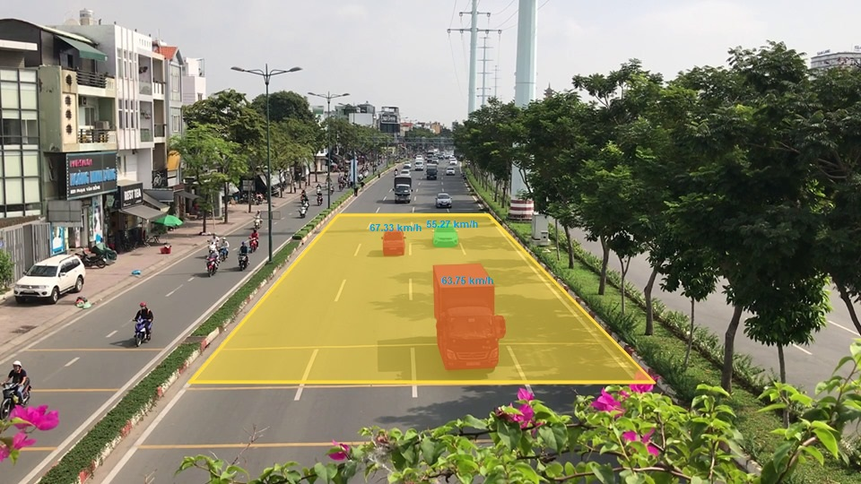
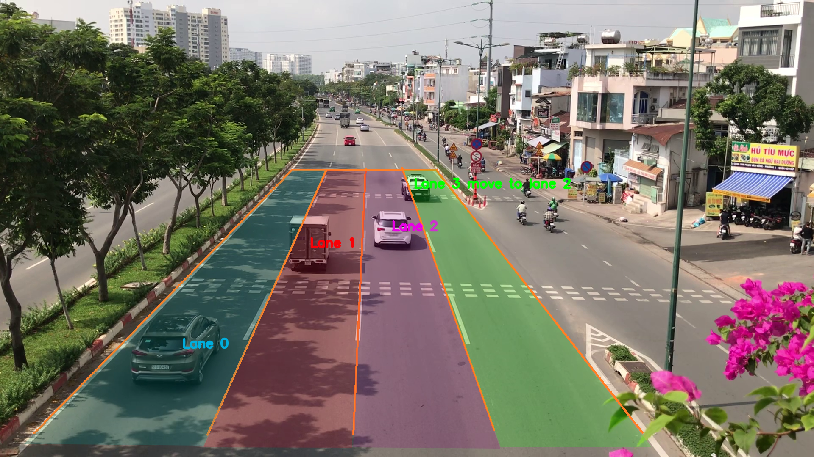

# Traffic monitoring system by computer vision and machine learning
The system is in a jupyter notebook in "source code" directory. For details, please take a look on [our paper](paper.pdf).

It is divide into two modes, and need a lot of pre-processing steps for different positions of a camera. 

Our system can solve three problems:
+ Overspeed
+ Wrong lane departure
+ Cross the red line

We combined "overspeed" and "wrong lane deparute" features into "speed" mode to estimate speed and find lanes on highway. Another mode is "crossRedLine", this mode will detect the violated vehicles at intersections.

We success in catching the violation situations

<figcaption>Fig 1. Assumming the speed limited is 60km/h, there were two detected violated vehicles </figcaption>

<figcaption>Fig 2. The system know that a car in green lane is moving in purple lane</figcaption>

<figcaption>Fig 3. While the traffic light was red, there were two vehicle crossing over the white line</figcaption>

However, there are a lots of problem we need to solve. For example, we often lose vehicle ID when it was overlapping with others. 

<figcaption>Fig 4. Result from "crossRedLine" mode</figcaption>

In Fig 4, in yellow area, there are 7 violated vehicles. However, system can only detect 2 vehicles.

This system can take the input from local video or stream link. We use Twitch server for streaming. While processing with stream video, we realized that the foreign vehicles returned the better results than Vietnamese vehicles for YOLOv3 and SORT.  

We will try to optimize our system tracking result by using ***Deep Sort*** and pre-train YOLO with Vietnamese data in the future.

## How to run this system?
To run this system, we need to prepare a lot of parameters.

* ***Mode***. This system divide into two mode, ***speed*** for measuring speed and lane of each vehicle and ***crossRedLine*** for detecting violated vehicles (only work when YOLOv3 can catch the traffic light). 
* ***Three vanishing points*** for different angles of camera, in this project we use diamond space method which follow by [a project of Brno University of Technology in Czech Republic](http://www.fit.vutbr.cz/research/groups/graph/pclines/papers/2013-BMVC-Dubska-VanishingPointsDetection.pdf).
* ***The principle point*** is the center of each frame $pp=(W//2,H//2)$
* ***Scene Scale***: we need to convert two points from image to Road plane coordinate, then find the distance by Euclidean's distance. Finally find that distance in real coordinate and divide it with the Euclidean's distance. You can get the distance in real coordinate by google map or measure by other methods.
* ***Best performance range***. The camera calibration is not good on all positions of each frame. You will need to test many case to find the region of interest (RoI) for each different angle.
* ***All lines***, it is necssary to find all the "lane" lines on a frame of video. We haven't found the automatic way to find these lines so we measure them by the simple line equation of 2D coordinate: $y=ax+b$ with $x$ and $y$ is two random points on each line.
* ***Mask***. A path lead to binary image, divide the special area in ***crossRedLine*** mode, read paper for more information. 
* ***deadLine***. A list with three parameter [a,b,c] where a,b and c is the parameter of line equation $ax+by+c=0$
* ***allowed_line*** is a list contain indexs of allowed lanes.

The way how to run code in notebook named ***Systems.ipynb***, take a look for more details.