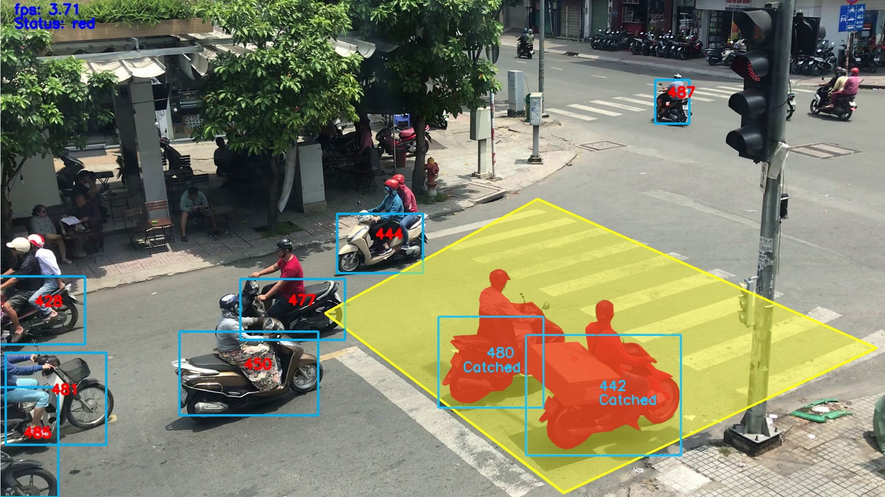
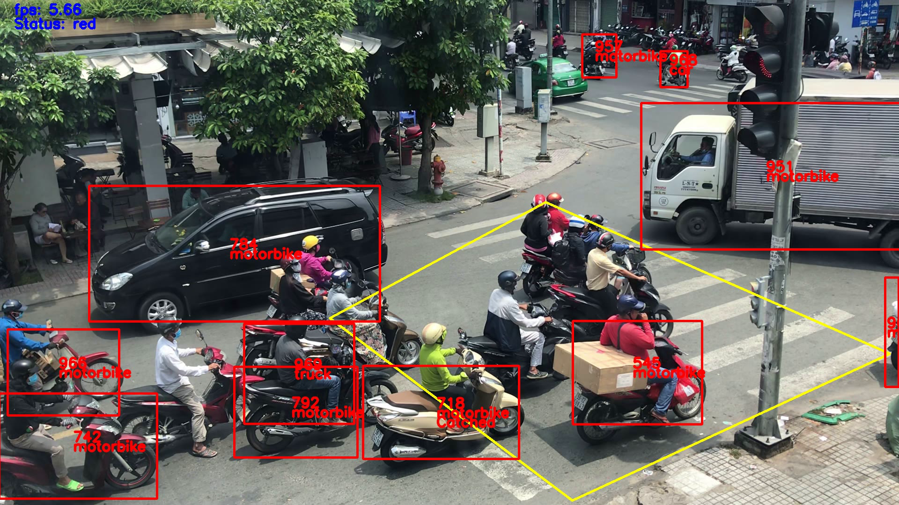

# Traffic monitoring system by computer vision and machine learning
The system is in a jupyter notebook in "source code" directory. For details, please take a look on [our paper](paper.pdf).

It is divide into two mode, and need a lot of pre-processing step for different position of a camera. 

Our system can solve three problem:
+ Overspeed
+ Wrong lane departure
+ Cross the red line

We combined "overspeed" and "wrong lane deparute" into one mode, because it can solve on highway and called that mode is "speed". Another mode is "crossRedLine", this mode work well with the intersection road where has the traffic light.

We success in catching the violation situations

<figcaption>Fig 1. Assume speed limited is 60km/h, two vehicle get violation</figcaption>

<figcaption>Fig 2. System know that vehicle in green lane is moving in purple lane</figcaption>

<figcaption>Fig 3. While the light is red, two vehicle cross over the white line</figcaption>

However, there are a lots of problem we need to face with. For example, we use SORT as tracking algorithm, so when the vehicles get overlap, it will reset the ID of that vehicle and assume that is the new one. 

<figcaption>Fig 4. A frame in result video from "crossRedLine" mode</figcaption>

In Fig 4, in yellow area, there are 7 vehicle and all of them get violation. However, system can only recognize 2 vehicles and one of them will get the ticket.

This system can take the input is local video or even stream link. We use twitch server for streaming. While processing with stream video, we realized that 720p video (resolution: 1080x720 pixels) returned better results with YOLOv3 and SORT algorithm. 

We will focus on the resolution and other algorithm such as ***Deep Sort*** in the future.